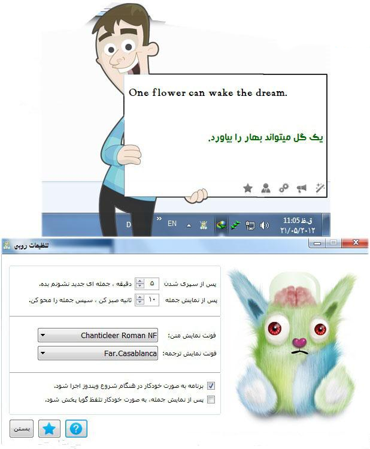

# Rubi v3.2 (Relife Edition)

**نسخه معکوس‌شده Rubi - بدون محدودیت و با امکانات ویژه**

[Mohammad X](https://x.com/m_khani65/) | [Rubi Reversed](https://github.com/amm1rr/rubi-relife)

## تغییرات اتفاق افتاده

- **حذف محدودیت‌ها:** دسترسی کامل به تمامی قابلیت‌های نرم‌افزار
- **اصلاح لینک‌های راهنما:** جایگزینی لینک‌های راهنما با نسخه‌های آرشیو شده برای دسترسی دائمی
- **به‌روزرسانی لینک‌ها:** جایگزینی برخی لینک‌ها با شبکه‌های اجتماعی و صفحه اختصاصی نسخه Reversed برای دنبال کردن آخرین اخبار و بروزرسانی‌ها

---

## راهنمای نصب و استفاده

1. **دانلود و نصب:** فایل نصب [Rubi-v3.2-Setup.exe](https://github.com/Amm1rr/Rubi-Relife/raw/refs/heads/main/Rubi%20v3.2%20-%20Setup.exe) را دریافت و اجرا کنید.
2. **نصب کرک:** فایل [ReLife.exe](https://github.com/Amm1rr/Rubi-Relife/raw/refs/heads/main/ReLife.exe) را دریافت و اجرا و جایگزین کنید.
3. **ثبت‌نام / ورود:** با هر اطلاعات دلخواه (ایمیل و رمز عبور جعلی) ثبت‌نام یا وارد شوید.
4. **استفاده و لذت بردن:** از نسخه کامل و بدون محدودیت Rubi استفاده کنید!

---

## نکات مهم

- **هشدار آنتی‌ویروس:** به دلیل فشرده بودن فایل اصلی، احتمال هشدار آنتی‌ویروس به فایل و کرک وجود دارد. لطفا دسترسی‌های لازم را بدهید.
- **کاربرد آموزشی و پژوهشی:** این پروژه صرفا با اهداف آموزشی و پژوهشی ارائه شده است.
- **توقف توسعه اصلی و اصلاحات:** این نرم‌افزار یک پروژه از بین رفته بود که با کمی تغییرات و وصله قابل استفاده شد.
- **مسئولیت استفاده:** مسئولیت هرگونه استفاده از نرم‌افزار بر عهده کاربر می‌باشد.
- **حقوق توسعه‌دهنده اصلی:** کلیه حقوق مادی و معنوی متعلق به توسعه‌دهنده اصلی MBNSoft (ره) محفوظ است.

---

_**توضیحات از توسعه دهنده اصلی:**_

## روبی چیست؟

در دنیای امروز جهت فراگیری زبان انگلیسی راهکارهای مختلفی وجود دارد. از جمله کلاس‌های آموزشی، سی دی های مالتی مدیا، کتاب و متدهای متعدد دیگر. ایراد استفاده از هر یک از روشهایی که ذکر شد، نیاز به هزینه کردن، ضایع شدن وقت و زمان و حوصله نسبتا طولانی است. و مهمتر از همه اینکه اکثر روشهای مرسوم، بسیار خسته کننده و یکنواخت هستند و فراگیران آن معمولا هیچ جذابیتی نداشته و این خود باعث میشود فرد پس از مدتی از آن زده شده و از ادامه دادن روند آموزش، صرف نظر کند. در این میان، روبی که برای فرد، هم جالب و جذاب باشد، هم سریع به نتیجه مطلوب برسد و هم کم هزینه و ارزان باشد، تنها استفاده از متد آموزش زبان انگلیسی توسط نرم افزار روبی (Rubi) است.

## روند آموزش زبان انگلیسی در نرم افزار روبی چگونه است؟

مغز انسان در اثر تکرار یک رخداد قابل تحلیل، برداشت خود را در ابتدا به حافظه کوتاه مدت و سپس در بازه زمانی کوتاهتر به حافظه بلند مدت انتقال داده و به اصطلاح ملکه ذهن خواهد کرد. نرم افزار روبی از این قابلیت مغز انسان بهره گرفته و جهت آموزش زبان انگلیسی، از آن استفاده میکند. به این صورت که مجموعه ای ارزشمند از جملات، اصطلاحات روزمره، ضرب المثلها و موضوعات متنوع دیگر، با تلفیقی خاص و زمانبندی قابل تنظیم، در قالب یک رخداد تکرار پذیر به شما نمایش داده و در نتیجه پس از سپری شدن مدت زمان کوتاهی برای همیشه در حافظه بلند مدت شما حک خواهد شد.

## امکانات نرم افزار روبی در بسته 3.0:

- امکان جستجوی پیشرفته در جملات
- امکان ویرایش (Review) جملات دیگران
- انتخاب و تغییر رنگ متن و پس زمینه جملات
- امکان ثبت رتبه (Rate) برای جملات دیگران
- دسترسی به تقویم (شمسی، میلادی، قمری)
- امکان درج تصویر پس زمینه جملات با مدیریت کامل
- نوار ابزار کلمات (تلفظ ترجمه، کپی، پررنگ، جستجو)
- امکان ترجمه اتوماتیک متن انگلیسی به کمک مترجم گوگل
- نوشتن جمله جدید و مدیریت کامل (ویرایش، نمایش، حذف)
- امکان ترکیب رنگ با تصویر پس زمینه جهت خواناتر بودن متن جملات
- امکان دریافت جملات جدید از سرور روبی و بروزرسانی بانک دانش نرم افزار
- انتخاب و تغییر فونت نمایش جملات به صورت جداگانه (فارسی و انگلیسی)
- امکان ثبت، ویرایش و حذف یادآوری بر روی هر یک از روزهای سال در محیط تقویم روبی
- امکان پخش تلفظ جمله به دو روش: 1- بلندگو و 2- تلفظ با استفاده از سرویس تلفظ گوگل
- امکان صدور فایل پشتیبان از جملات بانک دانش نرم افزار و وارد کردن مجدد فایل پشتیبان در آینده
- امکان انتخاب کلمات جمله (فارسی و انگلیسی) توسط ماوس و انجام عملیات مختلف بر روی هر کلمه
- پوشش و ارسال پیغام، نمایش لیست پیغام های ارسالی (Inbox) و نمایش لیست پیغام های دریافتی (Outbox)
- و امکانات بی نظیر دیگر.
